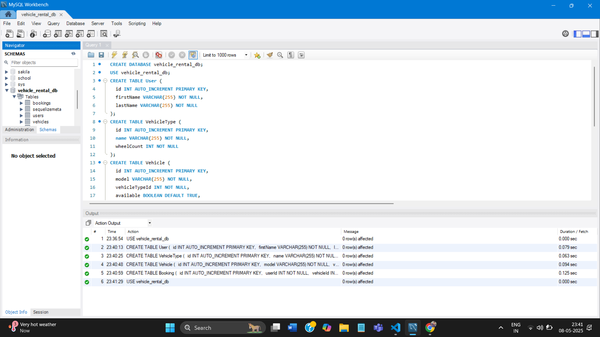

# 🚗 Vehicle Rental System

A full-stack application to allow users to book vehicles for rent by filling out a form interface. The system ensures that no two bookings for the same vehicle overlap and fetches all vehicle details dynamically from a SQL-based database.

## 📋 Summary

- Users enter their personal and booking information through a step-wise form.
- Backend handles bookings with validation to avoid overlapping bookings.
- SQL database manages users, vehicle types, vehicles, and bookings.
- Data is dynamically fetched for front-end display.

---

## ⚙️ Tech Stack

### Backend

- **Node.js**
- **Express.js**
- **Sequelize ORM**
- **MySQL**

### Frontend

- **React.js**
- **Material UI**
- **Tailwind CSS**

---

## 📁 Folder Structure

vehicle-rental-system/
├── backend/
│ ├── config/
│ ├── controllers/
│ ├── migrations/
│ ├── models/
│ ├── routes/
│ ├── seeders/
│ ├── .sequelizerc
│ └── server.js
└── frontend/
├── public/
├── src/
│ ├── components/
│ ├── services/
│ └── ...

---

## 🚀 Project Setup

### ✅ Prerequisites

- Node.js and npm installed
- MySQL installed and running

---

## 🛠️ Installation Steps

### 1️⃣ Clone the Repository

```bash
git clone https://github.com/Priyanshushekhar77/Octalogic_vehicle-Rental.git
cd vehicle-rental-system

cd backend
npm install

DB_NAME=vehicle_rental_db
DB_USER=root
DB_PASSWORD=admin
DB_HOST=127.0.0.1
DB_DIALECT=mysql

npx sequelize-cli db:create
npx sequelize-cli db:migrate
npx sequelize-cli db:seed:all

cd ../frontend
npm install

npm start


🌐 Backend Logic
Users, Vehicles, VehicleTypes, Bookings defined in Sequelize models
Validations prevent overlapping bookings
REST APIs:
GET /vehicles/types – get vehicle types

GET /vehicles?typeId=... – fetch vehicles by type

POST /bookings – submit a booking form

Sequelize migrations and seeders setup initial DB values

💻 Frontend Logic
Multi-step booking form:

First & Last Name

Wheel Count (2 or 4)

Vehicle Type (filtered by wheel count)

Specific Vehicle (filtered by type)

Date Range Picker

Only proceeds if current step is valid

On final step, submits data to backend



(./assets/booking.png)
(./assets/users.png)

```
